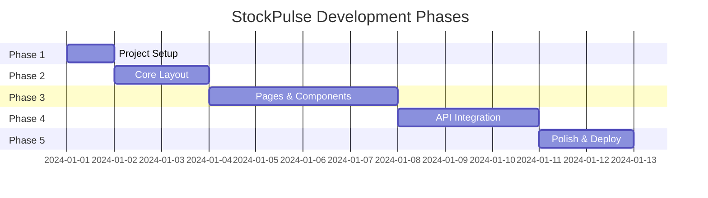

# StockPulse Dashboard - MVP Document

A comprehensive stock market dashboard for tracking, analyzing, and managing stock investments.

---

## Table of Contents
1. [Project Overview](#project-overview)
2. [Tech Stack](#tech-stack)
3. [Implementation Phases](#implementation-phases)
4. [Phase Details](#phase-details)
5. [Success Criteria](#success-criteria)

---

## Project Overview

**StockPulse Dashboard** is a modern web application that provides real-time stock market data, interactive charts, personalized watchlists, and financial news aggregation.

### Core Features
- 📈 **Home Dashboard** - Market overview with key indices and trending stocks
- 🔍 **Stock Details** - Detailed stock information with interactive charts
- ⭐ **Watchlist** - Personal watchlist with LocalStorage persistence
- 📰 **News Feed** - Aggregated financial news and market updates

---

## Tech Stack

| Category | Technology |
|----------|-----------|
| **Framework** | React 19 + Vite 7 |
| **Styling** | Tailwind CSS v4 |
| **Routing** | React Router v7 |
| **HTTP Client** | Axios |
| **Charts** | Recharts |
| **API** | Finnhub / Yahoo Finance |
| **State** | React Context + LocalStorage |

---

## Implementation Phases



---

## Phase Details

### Phase 1: Project Setup ✅
> **Status:** Complete

| Step | Task | Status |
|------|------|--------|
| 1.1 | Initialize React + Vite project | ✅ |
| 1.2 | Install dependencies (axios, recharts, react-router-dom) | ✅ |
| 1.3 | Configure Tailwind CSS v4.1.17 | ✅ |
| 1.4 | Set up folder structure | ✅ |
| 1.5 | Configure environment variables | ⏳ Pending |

**Folder Structure:**
```
src/
├── assets/          # Static assets (images, icons)
├── components/      # Reusable UI components
│   ├── common/      # Buttons, Inputs, Cards
│   ├── charts/      # Chart components
│   └── layout/      # Navbar, Sidebar, Footer
├── pages/           # Page components
│   ├── Home/
│   ├── StockDetails/
│   ├── Watchlist/
│   └── News/
├── services/        # API service layer
├── hooks/           # Custom React hooks
├── context/         # React Context providers
├── utils/           # Helper functions
└── styles/          # Global styles
```

---

### Phase 2: Core Layout ✅
> **Status:** Complete

| Step | Task | Description |
|------|------|-------------|
| 2.1 | Create Navbar component | Logo, search bar, navigation links |
| 2.2 | Create Sidebar component | Quick navigation, market summary |
| 2.3 | Create Footer component | Links, copyright, social media |
| 2.4 | Set up React Router | Configure routes for all 4 pages |
| 2.5 | Create MainLayout wrapper | Combine layout components |

**Key Components:**
- `Navbar` - Fixed top navigation with search
- `Sidebar` - Collapsible side navigation
- `MainLayout` - Page wrapper with consistent spacing

---

### Phase 3: Pages & Components ✅
> **Status:** Complete

#### 3.1 Home Page
| Step | Component | Features |
|------|-----------|----------|
| 3.1.1 | MarketOverview | Major indices (S&P 500, NASDAQ, DOW) |
| 3.1.2 | TrendingStocks | Top gainers/losers cards |
| 3.1.3 | QuickStats | Portfolio summary widget |
| 3.1.4 | MiniChart | Sparkline charts for quick view |

#### 3.2 Stock Details Page
| Step | Component | Features |
|------|-----------|----------|
| 3.2.1 | StockHeader | Symbol, name, current price, change |
| 3.2.2 | StockChart | Interactive candlestick/line chart |
| 3.2.3 | StockStats | Key statistics (P/E, Market Cap, etc.) |
| 3.2.4 | CompanyInfo | Company description, sector, industry |
| 3.2.5 | AddToWatchlist | Button to add/remove from watchlist |

#### 3.3 Watchlist Page
| Step | Component | Features |
|------|-----------|----------|
| 3.3.1 | WatchlistTable | Table of watched stocks |
| 3.3.2 | WatchlistCard | Mobile-friendly card view |
| 3.3.3 | EmptyState | Prompt when watchlist is empty |
| 3.3.4 | RemoveStock | Remove stock from watchlist |

#### 3.4 News Page
| Step | Component | Features |
|------|-----------|----------|
| 3.4.1 | NewsCard | Article preview with image |
| 3.4.2 | NewsFilter | Filter by source/category |
| 3.4.3 | NewsList | Paginated news feed |
| 3.4.4 | FeaturedNews | Hero section for top stories |

---

### Phase 4: API Integration
> **Status:** Pending

| Step | Task | Details |
|------|------|---------|
| 4.1 | Create API service file | Base Axios config with interceptors |
| 4.2 | Implement stock search endpoint | Search stocks by symbol/name |
| 4.3 | Implement stock quote endpoint | Get real-time price data |
| 4.4 | Implement historical data endpoint | Get chart data (1D, 1W, 1M, 1Y) |
| 4.5 | Implement news endpoint | Get market news articles |
| 4.6 | Add error handling | Toast notifications, fallback UI |
| 4.7 | Implement caching | Reduce API calls with local cache |

**API Endpoints (Finnhub):**
```javascript
// services/stockApi.js
const endpoints = {
  search: '/search',
  quote: '/quote',
  profile: '/stock/profile2',
  candles: '/stock/candle',
  news: '/news'
};
```

---

### Phase 5: Polish & Deploy
> **Status:** Pending

| Step | Task | Details |
|------|------|---------|
| 5.1 | Add loading states | Skeleton loaders, spinners |
| 5.2 | Add error boundaries | Graceful error handling |
| 5.3 | Implement responsive design | Mobile-first breakpoints |
| 5.4 | Add animations | Smooth transitions, hover effects |
| 5.5 | Performance optimization | Code splitting, lazy loading |
| 5.6 | SEO optimization | Meta tags, titles, descriptions |
| 5.7 | Build & test production | Verify production build |
| 5.8 | Deploy to Vercel | Configure and deploy |

---

## Success Criteria

### MVP Requirements
- [ ] User can view market overview on Home page
- [ ] User can search for stocks
- [ ] User can view detailed stock information with charts
- [ ] User can add/remove stocks from watchlist
- [ ] Watchlist persists in LocalStorage
- [ ] User can browse financial news
- [ ] App is responsive on mobile/tablet/desktop

### Performance Targets
- [ ] First Contentful Paint < 1.5s
- [ ] Interactive < 3s
- [ ] No console errors in production
- [ ] Lighthouse score > 80

### Quality Checklist
- [ ] All pages have proper error states
- [ ] All pages have loading states
- [ ] All interactive elements have hover states
- [ ] Keyboard navigation works
- [ ] Color contrast meets WCAG AA

---

## Quick Reference

### NPM Scripts
```bash
npm run dev      # Start development server
npm run build    # Build for production
npm run preview  # Preview production build
npm run lint     # Run ESLint
```

### Environment Variables
```env
VITE_FINNHUB_API_KEY=your_api_key_here
VITE_API_BASE_URL=https://finnhub.io/api/v1
```

---

*Last Updated: December 9, 2024*
